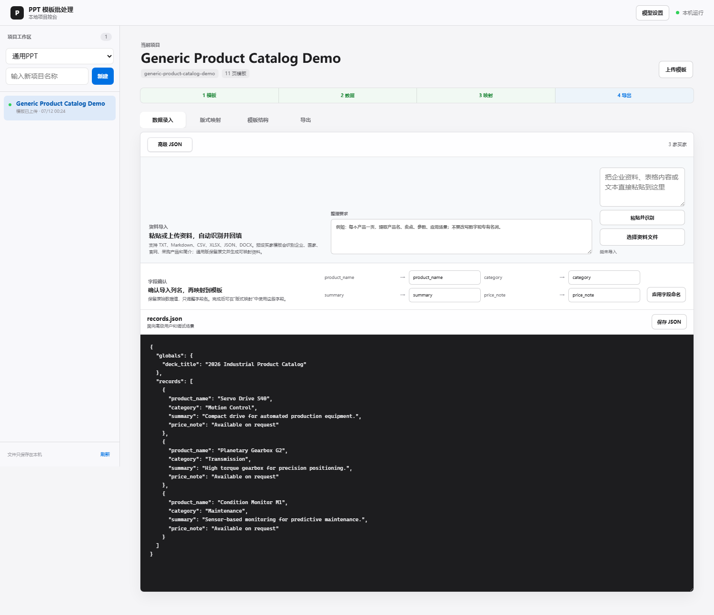
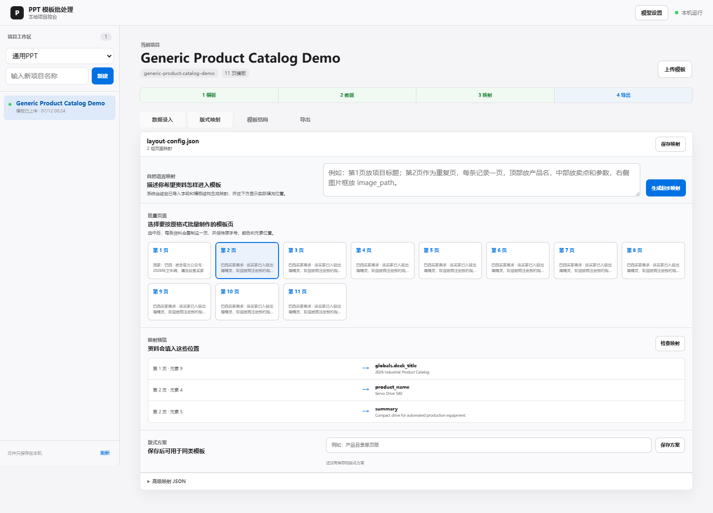
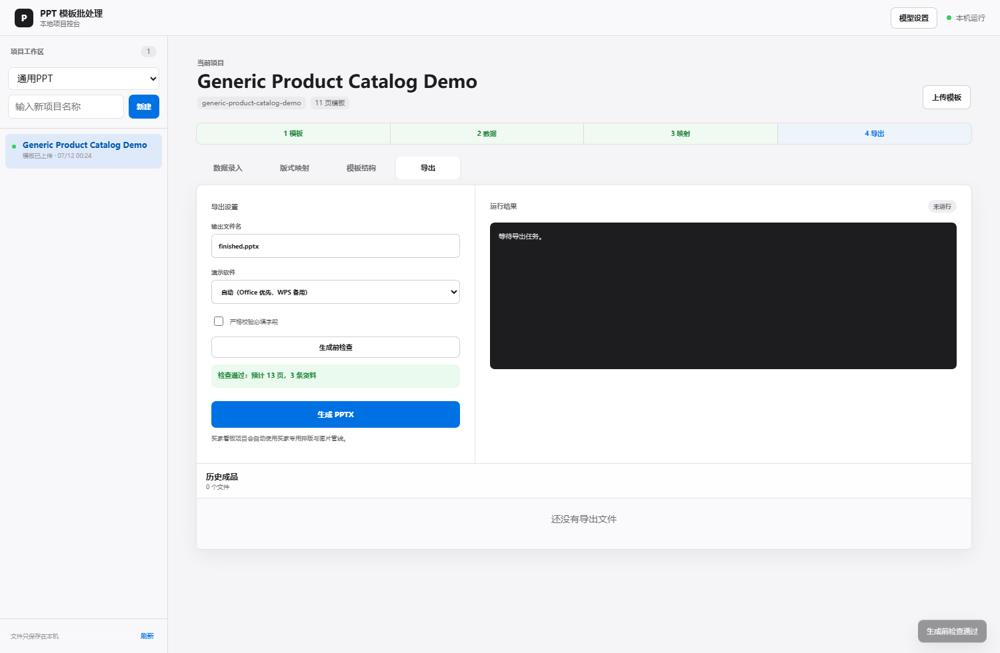

# PPT Template Batch Skill

Local-first, generic PPT template automation for turning an approved PPTX into a repeatable batch-production workflow. It decomposes template structure, connects imported data to layout rules, preserves approved visual styles, and produces consistent presentation files at scale.

This repository is focused on **generic PPT template automation**. Use it for product catalogs, client proposals, company profiles, market reports, training materials, quote sheets, event lists, and any repeated PPT layout. Buyer Board and Buyer Briefing are optional bundled presets, not the limit of the skill.

## Product Overview

The workflow is designed for teams that already have a PPT template and need to reuse it safely:

- Import TXT, Markdown, CSV, XLSX, JSON, or DOCX source material.
- Confirm and rename imported fields before mapping them to a template.
- Inspect slides, text boxes, tables, image placeholders, and repeated-page layouts.
- Define mappings with structured JSON or natural-language instructions.
- Batch-generate PPTX files through Microsoft Office, WPS Presentation, or compatibility mode.
- Run preflight checks for missing mapped fields, unresolved placeholders, missing assets, and oversized content before export.

## Console Walkthrough

### 1. Import Data And Confirm Fields

Paste source material or import a spreadsheet, then confirm the imported column names before mapping them to the template. This keeps data preparation independent from any specific PPT layout.



### 2. Select Repeated Pages And Review Mappings

Choose the template page that should repeat for each record, describe the layout in natural language, and review the resulting field-to-element mappings before export.



### 3. Run Preflight Before Export

Choose the local presentation engine, validate required data and mappings, then generate PPTX files with an export history that preserves previous deliverables.



## What this repo contains

- `ppt-template-batch/`: the Codex skill package.
- `ppt-template-batch/scripts/`: reusable PPT decomposition, text filling, image placement, diagnostics, and buyer preset scripts.
- `ppt-template-batch/references/`: workflow rules for generic PPT batch processing and buyer-specific presets.
- `scripts/run_ppt_batch_pipeline.py`: generic one-click pipeline for config-driven PPT filling.
- `scripts/run_control_console.py`: local browser control console for project setup, editing, and export.
- `scripts/run_buyer_board_pipeline.py`: buyer-board preset one-click pipeline.
- `scripts/recover_real_assets.py`: buyer-board asset recovery helper when sandboxed runs cannot fetch real web assets.

## Core workflow

Use this skill when you want to turn any PPT/PPTX template into a repeatable batch workflow:

1. Provide a PPT template or manually adjusted reference deck.
2. Decompose slide structure, repeated pages, text boxes, tables, image placeholders, fixed elements, and styling.
3. Generate or refine `layout-config.json`.
4. Define the data contract, such as `records.json`, `buyers.json`, or `briefing-pages.json`.
5. Fill text while preserving template fonts, colors, alignment, and run-level styles where needed.
6. Replace approved image placeholders without touching fixed design elements.
7. Export one or many PPT files.
8. Verify slide count, required fields, missing records, encoding, and obvious layout regressions.

## Local control console

A browser-based local console is included for generic PPT project management, template upload, text or document import, natural-language layout mapping, JSON editing, slide-structure inspection, repeated-page selection, export controls, reports, and finished-file downloads. Buyer form entry and procurement research are optional preset capabilities.

~~~powershell
python scripts/run_control_console.py
~~~

The console opens on http://127.0.0.1:5310/ by default and stores projects under console-projects/. It has no frontend build dependency and continues to use the native Python/PPTX pipeline.

When creating a project, choose one of the built-in presets:

- Generic PPT: arbitrary template decomposition and config-driven filling.
- Buyer Board Preset: country plus procurement need, buyer profiles, logos, website/product visuals, and one-buyer-per-page layouts.
- Buyer Briefing Preset: compact category pages with a dedicated form: one category per slide and 6 buyers per slide.

Recent usability upgrades:

- Generic PPT projects can import TXT, Markdown, CSV, XLSX, JSON, or DOCX material, confirm imported field names, and convert it into `records.json`.
- Layout mapping can start from a natural-language instruction in the console and then be checked against Template Structure element indexes.
- Generic exports can use Microsoft Office, WPS Presentation, automatic detection, or compatibility mode.
- Export preflight reports missing mapped fields, unresolved data placeholders, and unusually long values before PPTX generation.
- Buyer research now builds a candidate pool and qualifies it by local presence, concrete demand scenarios, import or trade signals, public evidence, scores, confidence, and risks.
- Buyer-board projects include advanced controls for preferred industries, excluded company types, import-evidence priority, candidate-pool size, and free-form custom requirements.


### Capability-based model settings

The console does not require API keys for every project. API keys are only needed when a selected capability uses a remote model.

- Manual data entry, JSON/Excel import, template inspection, PPT filling, and PPT export run locally and do not need a model key.
- Buyer profile generation needs a text model only when the Buyer Research capability is enabled.
- AI visual fallback needs an image-capable model only when the AI Visual capability is enabled.
- Intelligent template analysis is optional; current template decomposition and export use local rules by default.

Buyer research defaults to `model_only`, which uses OpenAI-compatible `/chat/completions` and works with DeepSeek, Qwen, GLM, Kimi, SiliconFlow, OpenRouter, Ollama, LM Studio, and custom compatible endpoints. OpenAI built-in web search is an explicit opt-in mode, not the default.

### Feishu/Aily agent skill package

The `feishu-agent-skill/` folder is a portable agent-facing entrypoint for Feishu bots, Aily, and other agents that support Markdown skills. It uses the agent's native web search, image search, and image-generation abilities, so users do not need to enter a model API Key. Build a self-contained ZIP with the deterministic PPT engine included:

```powershell
python scripts/build_feishu_agent_skill.py --output output/ppt-template-batch-agent-skill.zip
```

Import the generated ZIP through the agent's local skill upload flow. Read `feishu-agent-skill/SKILL.md` and `feishu-agent-skill/references/agent-runtime.md` for the input contract and execution order.

## Supported modes

### Generic PPT batch mode

Use this when the template is not necessarily buyer-related: product catalogs, profile decks, reports, training pages, market snapshots, quote sheets, exhibitor lists, or other repeated PPT layouts.

Recommended artifacts:

- `template.pptx`
- `layout-config.json`
- `records.json`
- optional `assets/`
- optional `batch.json` for multiple output files

The current repo includes the workflow guidance for this mode in:

- `ppt-template-batch/references/generic-ppt-batch-workflow.md`
- `ppt-template-batch/references/layout-config-schema.md`
- `ppt-template-batch/scripts/fill_ppt_from_records.py`
- `scripts/run_ppt_batch_pipeline.py`
- `scripts/run_control_console.py`
- `ppt-template-batch/scripts/generate_layout_config.py`

Single generic run:

```bash
python scripts/run_ppt_batch_pipeline.py ^
  --template "path/to/template.pptx" ^
  --records "path/to/records.json" ^
  --layout-config "path/to/layout-config.json" ^
  --output "output/finished.pptx" ^
  --workspace "output/workspace"
```

Batch generic run:

```bash
python scripts/run_ppt_batch_pipeline.py ^
  --batch "path/to/batch.json" ^
  --output-dir "output/decks" ^
  --workspace "output/workspace"
```

For highly custom layouts, create a small dedicated filler script only after trying the config-driven filler. Reuse the same principles: preserve styles, use structured data, avoid stale template content, and verify outputs.

### Buyer-board preset

Use this when each content slide represents one buyer profile and the deck needs company name, country, website, procurement products, company bio, optional logo, and optional website/product visual.

This preset supports:

- template-based buyer-board generation
- layout-config scaffold generation from a reference PPT
- country + procurement-need driven buyer research
- structured buyer text filling
- public website logo and visual fetching
- optional Playwright-enhanced asset fetching
- asset cache reuse through `asset-cache.json`
- per-run asset report through `asset_fetch_report.json`
- PowerPoint COM image placement with Python fallback
- WorkBuddy/Windows diagnostics through `doctor.py`

Buyer research stores qualification details alongside each buyer:

- `buyer_type`
- `demand_scenarios`
- `local_presence`
- `import_signal`
- `evidence`
- `source_urls`
- `fit_score`, `demand_score`, `import_score`, `verification_score`, `total_score`
- `confidence`
- `risks`

CLI research can also accept:

```bash
--preferred-industries "食品机械、矿山、泵阀、输送设备制造商"
--excluded-company-types "纯电机制造商、无当地业务的海外公司"
--custom-requirements "优先当地企业，业务中对电机有必然需求，并优先有进口或代理证据"
--candidate-multiplier 3
```

One-click existing buyer preset data:

```bash
python scripts/run_buyer_board_pipeline.py ^
  --template "path/to/template.pptx" ^
  --buyers "path/to/buyers.json" ^
  --layout-config "path/to/layout-config.json" ^
  --output "output/finished.pptx" ^
  --preview-dir "output/previews" ^
  --workspace "output/workspace"
```

One-click buyer research mode:

```bash
python scripts/run_buyer_board_pipeline.py ^
  --template "path/to/template.pptx" ^
  --country "南非" ^
  --procurement-need "动力传动" ^
  --buyer-count 10 ^
  --output "output/finished.pptx" ^
  --preview-dir "output/previews" ^
  --workspace "output/workspace"
```

### Buyer-briefing preset

Use this for compact `买家商情` templates where each slide contains one category and 6 buyer entries.

```bash
python ppt-template-batch/scripts/fill_buyer_briefing_pages.py ^
  "path/to/template.pptx" ^
  "path/to/briefing-pages.json" ^
  "output/buyer-briefing.pptx"
```

`briefing-pages.json` should contain pages with `title` and 6 buyers. Each buyer should include `name`, `summary`, and `products`. The script preserves run-level text styles so the output stays close to the original template.

## Dependencies

Install dependencies first:

```bash
pip install -r requirements.txt
```

Optional for browser-enhanced asset discovery:

```bash
playwright install chromium
```

Set API keys only when using buyer research or AI visual fallback. The control console stores keys only in the current local process and never writes them to project files.

The console supports these provider modes:

- OpenAI: supports normal chat completions and the optional OpenAI built-in web search mode when the selected model has access.
- Domestic and compatible text providers: DeepSeek, Qwen, Zhipu GLM, Kimi, Doubao, MiniMax, SiliconFlow, OpenRouter, Ollama, LM Studio, and custom OpenAI-compatible endpoints use the `/chat/completions` path for text research and structuring.
- Image providers: enable only when AI visual fallback is selected. If not selected, website/logo/product-image fetching runs without a model key.

Use Model Settings in the console to select provider, Base URL, API Key, and model. Click Fetch models to call the upstream `/models` endpoint and populate model candidates. If the provider does not expose `/models` or the request fails, the console keeps built-in fallback model candidates such as `deepseek-chat`, `qwen-plus`, and `glm-4-plus`.

Optional CLI environment variables remain supported:

```powershell
$env:OPENAI_API_KEY="your_key_here"
$env:BUYER_RESEARCH_PROVIDER="deepseek"   # openai, deepseek, qwen, zhipu, kimi, siliconflow, openrouter, ollama, lmstudio, or compatible
$env:BUYER_RESEARCH_BASE_URL="https://api.deepseek.com"
$env:BUYER_RESEARCH_MODEL="deepseek-chat"
```

## WorkBuddy and Windows diagnostics

If a run behaves differently after downloading through WorkBuddy, run:

```bash
python ppt-template-batch/scripts/doctor.py
```

The report checks:

- Python modules
- `OPENAI_API_KEY` visibility
- public website access
- Playwright and Chromium runtime
- PowerPoint COM automation

If Python `urllib` requests are blocked but `curl` works, enable:

```powershell
$env:BUYER_BOARD_ENABLE_CURL_FALLBACK="1"
```

## Buyer asset recovery

If a buyer-board run finishes with missing real logos or website visuals because the sandbox blocked network access, rerun only the asset stage locally:

```powershell
powershell -ExecutionPolicy Bypass -File scripts/recover_real_assets.ps1 `
  -Workspace "output/workspace" `
  -AssetMode browser
```

Equivalent Python command:

```bash
python scripts/recover_real_assets.py ^
  --workspace "output/workspace" ^
  --asset-mode browser
```

## Output artifacts

Depending on the workflow, the workspace may contain:

- `layout-config.generated.json`: starter layout mapping
- `records.json`, `buyers.generated.json`, or `briefing-pages.json`: structured input data
- `fill_report.json`: generic per-job fill report
- `ppt_batch_report.json`: generic batch summary report
- `buyers.with-assets.json`: buyer data enriched with fetched image paths
- `asset-cache.json`: per-site asset cache
- `asset_fetch_report.json`: per-buyer image hit report
- `pipeline_failure.json`: failure details when a pipeline stage fails
- `assets/`: downloaded public assets
- `previews/`: exported slide previews when available

## Current boundaries

- The generic PPT direction is active, but many bundled scripts still carry buyer-board names for compatibility.
- Arbitrary PPT templates still require first-run decomposition and mapping verification.
- The generic runner supports common shape, table, placeholder, repeated-slide, and image-slot patterns; unusual animations, SmartArt, charts, and complex grouped objects may still need a custom filler.
- Public website asset fetching is best-effort and depends on local network permissions.
- Browser-enhanced fetching improves dynamic-site coverage but increases runtime and local dependency weight.
- AI right-side visual fallback is opt-in and does not generate logos.
- When no verified image is available, the workflow should clear risky stale placeholders rather than inventing fake brand assets.

## Privacy note

Do not publish client-specific finished decks, private templates, generated previews, or real customer deliverables in this public repo.

When sharing examples, prefer:

- blank or redacted templates
- generic layout-config samples
- sanitized JSON examples
- workflow documentation rather than real customer outputs

## Roadmap

The next direction is to deepen generic PPT support:

- add a broader visual layout-config generator for non-buyer templates
- add reusable validators for style preservation and stale placeholders
- add optional preview export for generic runs when PowerPoint COM is available
- keep buyer-board and buyer-briefing as bundled presets

## Sharing

This repository is public. Other users can clone it, download the ZIP, install the skill, and submit feedback through Issues or Discussions.


## Actual buyer selection

Buyer research should not treat every manufacturer as a buyer. Prefer actual procurement accounts: end users, distributors/importers/resellers, EPC or project developers, integrators, maintenance contractors, and manufacturers only when they clearly purchase the requested product as equipment, components, consumables, spare parts, or resale inventory. Asset fetching defaults to lightweight HTML parsing; browser fallback is opt-in to avoid slow or stuck website crawls.
